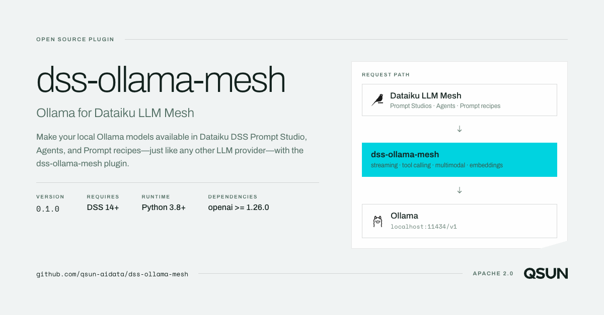
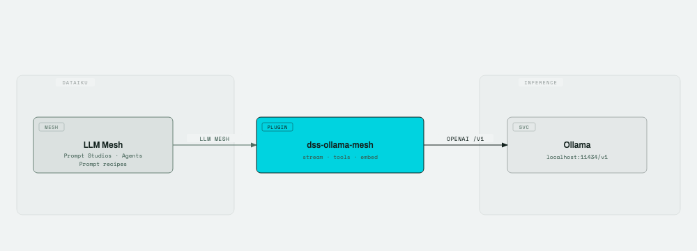
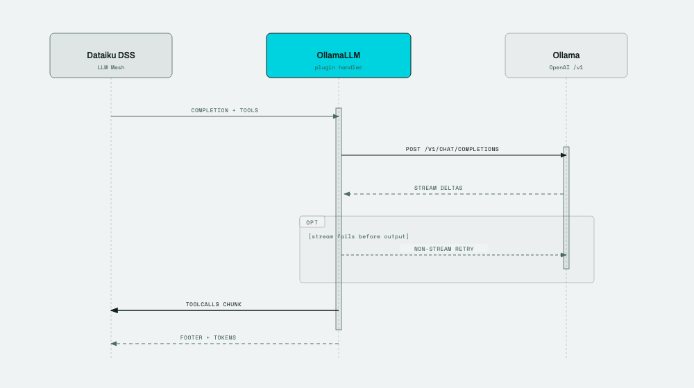

# Ollama for Dataiku LLM Mesh

Make your local Ollama models available in Dataiku DSS Prompt Studios, Agents, and Prompt
recipes — just like any other LLM provider — with the **`dss-ollama-mesh`** plugin.

It connects the LLM Mesh to [Ollama](https://ollama.com/) through Ollama's OpenAI-compatible
API: streaming chat, tool calling, multimodal input and text embeddings, with a per-model
concurrency limit and bounded retry on transient errors.




**Author:** Qian SUN · [contact@qsun.fr](mailto:contact@qsun.fr)  
**License:** [Apache 2.0](LICENSE)

## Architecture



Editable source: [docs/diagrams/architecture.html](docs/diagrams/architecture.html) · [SVG](docs/diagrams/architecture.svg)

## Streaming chat flow



Editable source: [docs/diagrams/chat-sequence.html](docs/diagrams/chat-sequence.html) · [SVG](docs/diagrams/chat-sequence.svg)

## Features

| Capability | Details |
|---|---|
| Chat completion | Multimodal messages (text + inline/URI images) |
| Tool calling | OpenAI-style tools; `toolCalls` emitted as separate stream chunks |
| Streaming | Token-by-token output, with a non-stream retry when streaming fails before any output |
| Embeddings | Single and batch embedding queries |
| Generation settings | Temperature, max output tokens, top-p, top-k, stop sequences, seed and JSON response format |
| Concurrency | One semaphore per `(base_url, model)` pair |
| Retry | Exponential backoff with ±25% jitter on 429, 5xx, timeout and connection errors, under a wall-clock budget |

## Requirements

- Dataiku DSS 14+ with LLM Mesh
- Python 3.8+ code environment (plugin-managed)
- Ollama with the OpenAI-compatible endpoint (default `http://localhost:11434/v1`)
- One package: `openai>=1.26.0,<3.0` — the floor is set by `stream_options`, which
  earlier releases of the SDK do not accept

Recent Ollama builds report token usage during streaming via `stream_options`. A
server that rejects that field falls back to a non-streaming request
automatically, so older Ollama versions still work — they just report no usage.

## Installation

1. Download `dss-ollama-mesh-<version>.zip` from the
   [releases page](https://github.com/qsun-aidata/dss-ollama-mesh/releases), or
   build it yourself with `make dist`.
2. In DSS, open **Administration → Plugins → Add plugin → Upload** and select
   that zip. (Installing directly from the Git repository works too.)
3. Open the plugin **Summary** tab and **Build** the Python code environment.
4. Go to **Administration → Connections → New connection → Custom LLM connection**.
5. Select this plugin, add a model, and configure the parameters below.

## Connection parameters

| Parameter | Description |
|---|---|
| **Ollama Base URL** | OpenAI-compatible endpoint. Use the host IP when DSS and Ollama run on different machines. Default: `http://localhost:11434/v1` |
| **Model** | Full Ollama model name including tag, e.g. `llama3.1:latest` |
| **API Key** | Optional bearer token for Ollama Cloud, a reverse proxy, or other secured endpoints. Leave empty for local Ollama (uses the placeholder `ollama`). |
| **Max concurrent requests** | Per-model concurrency limit. 1–2 for large local models; 8–16 for cloud models. |
| **Enable streaming** | Stream tokens as they arrive. Disable if a model omits tool calls while streaming. |

### Model capabilities in DSS

When adding models to the connection, assign capabilities as needed:

- **Chat completion (multimodal)** → `OllamaLLM`
- **Text embedding** → `OllamaEmbeddingModel`

## Security notes

- Point **Ollama Base URL** only at Ollama instances you trust. The plugin forwards prompts and tool outputs to that endpoint.
- The Base URL must be HTTP(S); remote endpoints with an API Key require HTTPS. HTTP is retained for the local Ollama default.
- `IMAGE_URI` parts are restricted to HTTP(S), but Ollama or a proxy may fetch them server-side. Treat image URLs as an outbound-network/SSRF boundary and use trusted URLs only.
- Tool calls returned by Ollama are accepted only when their names were declared in the request. Treat the model and endpoint as untrusted when exposing tools with side effects.
- Local Ollama does not authenticate requests. **Do not expose port 11434 to the public internet** without a reverse proxy and authentication.
- For Ollama Cloud or proxied deployments, set **API Key** to your bearer token and use HTTPS.
- Debug logging uses `logger.debug` with **summaries only** (counts, not message bodies).
  Raising the log level still adds metadata to DSS logs, but never writes full prompts.

## Project layout

```
dss-ollama-mesh/
├── plugin.json
├── python-lib/dssollamamesh/         # shared logic, importable in DSS code envs
│   ├── constants.py                  # defaults, retry policy, timeouts
│   ├── client.py                     # OpenAI client factory + transient-error policy
│   ├── concurrency.py                # per-(base_url, model) semaphore registry
│   ├── retry.py                      # backoff, jitter, wall-clock budget
│   ├── messages.py                   # DSS ↔ OpenAI message/tool/settings conversion
│   ├── streaming.py                  # tool-call delta accumulation
│   └── util.py                       # key aliasing, image MIME sniffing
├── python-llms/ollama-mesh/          # OllamaLLM + OllamaEmbeddingModel
├── code-env/python/spec/requirements.txt
├── scripts/build-plugin-zip.sh       # `make dist` — builds from committed files only
├── tests/                            # pytest suite (see below)
└── docs/diagrams/                    # architecture + sequence diagrams
```

Only `client.py` imports `openai`, and the package exposes it lazily, so every other
module — and most of the test suite — imports without the SDK installed.

## Development notes

Four Dataiku integration details worth knowing when extending this plugin:

1. `process_stream` must be a generator function (its body contains `yield`).
2. `toolCalls` must be pushed as a separate chunk — DSS ignores them in the footer.
3. Assistant `tool_calls` must be preserved when replaying conversation history.
4. DSS tool results arrive as `{'role':'tool', 'toolOutputs':[...]}` and may bundle several
   parallel results in one message; split them into separate OpenAI-format tool messages.

### Retry and concurrency behaviour

- Backoff is exponential with ±25% jitter, capped per attempt (`RETRY_MAX_DELAY`) and
  bounded overall by `RETRY_TOTAL_BUDGET`, so a failing call cannot pin a DSS worker
  thread for `MAX_RETRIES × REQUEST_TIMEOUT`. Tune both in `constants.py`.
- The semaphore for a `(base_url, model)` pair is created by whichever connection reaches
  it first. A second connection configuring a different limit for the same pair gets a
  warning in the DSS logs and keeps the established limit — a live semaphore cannot be
  resized safely.
- Streaming holds its concurrency slot for the whole response. That is deliberate: Ollama
  keeps the request's slot busy until the stream is fully read.

### Known limitations

- The `trace` (`SpanBuilder`) argument is accepted but no spans are emitted, so DSS
  LLM Mesh tracing shows nothing for this provider.

### Running the tests

```bash
pip install -r requirements-dev.txt
pytest -q          # no DSS and no Ollama required
ruff check .
make dist          # build the installable plugin zip
```

`pyproject.toml` puts `python-lib/` on the import path, so `PYTHONPATH` does not need
setting. See [CONTRIBUTING.md](CONTRIBUTING.md) for the design invariants worth keeping.

## Contributing and security

- [CONTRIBUTING.md](CONTRIBUTING.md) — setup, layout, and what to preserve when changing things
- [SECURITY.md](SECURITY.md) — how to report a vulnerability privately
- [CHANGELOG.md](CHANGELOG.md) — what changed between releases

## License

Copyright 2026 Qian SUN \<contact@qsun.fr\>

Licensed under the Apache License, Version 2.0. See [LICENSE](LICENSE) for the full text.
